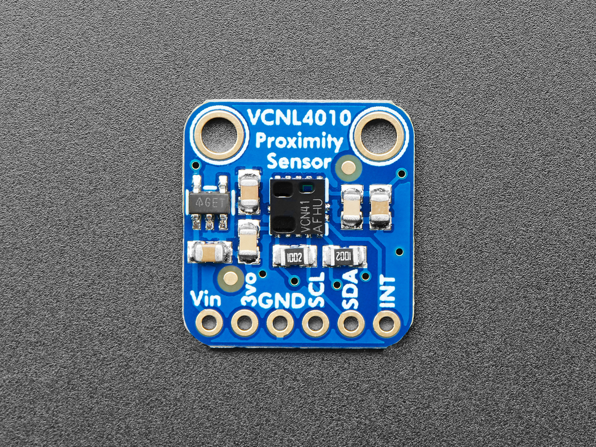

# VCNL4010 Library in STM32 HAL

## Abstract
- This library is developed for STM32 and uses the VCNL4010 sensor (proximity and ambient light sensor). The development is based on the reference from VISHAY's official datasheet.

- The library includes a VCNL_Struct structure, which allows support for multiple sensors' readings if the host device has multiple I2C interfaces. This structure needs to be invoked in most functions, as the sensor data will be stored in the structure for easy access. This library is entirely developed in C language.

- In terms of hardware, we have chosen to develop using the STM32F407-DISC1 and the VCNL4010 module produced by Adafruit.
  
  

- NOTICE:
  1. If you encounter compilation failure due to the absence of the "printData" function, please replace "printData" with your own function for displaying data (e.g., printf), or copy it from the main file of the example program and use it accordingly.

## Example
- In this example, data from both the ambient light sensor and proximity sensor is read simultaneously. However, the feedback data speed will be slower due to the lower sampling rate of the ambient light sensor itself. The specific wiring is shown in the following table.
   | STM32 PIN | Device PIN |
  | --- | --- |
  |PD2|PC RX|
  |PD3|PC TX|
  |PB6|vcnl4010 SCL|
  |PB7|vcnl4010 SDA|
  |5V|5V|
  |GND|GND|

## Reference
- [VCNL4010 Datasheet]

[VCNL4010 Datasheet]:chrome-extension://efaidnbmnnnibpcajpcglclefindmkaj/https://www.vishay.com/docs/83462/vcnl4010.pdf
